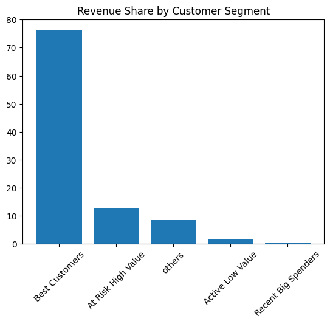
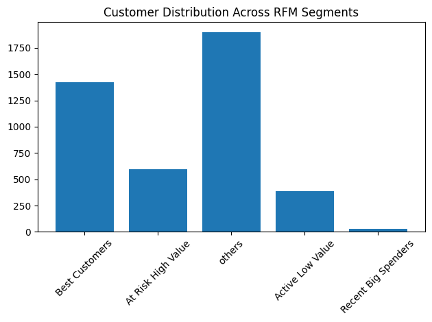

# Customer Segmentation with RFM Analysis

## Overview
This project analyzes customer purchasing behavior using the RFM (Recency, Frequency, Monetary) method.

The analysis was performed using SQL and Python on the Online Retail dataset.

---

## Objectives
- Identify high-value customer groups
- Analyze customer distribution across segments
- Evaluate which customer groups contribute most to total revenue

---

## Tools
- SQL (DuckDB)
- Python
- pandas
- matplotlib

---

## Methodology

### RFM Metrics
- Recency: How recently the customer placed the last order
- Frequency: How frequently the customer placed orders
- Monetary: Total amount spent by the customer

### Customer Segments
Customers were categorized into the following groups:
- Best Customers
- At Risk High Value
- Active Low Value
- Recent Big Spenders
- Others

---

## Results

### Revenue Share by Customer Segment

Best Customers contributed more than 75% of total revenue while representing only around 30% of all customers.

At Risk High Value customers generated the second-largest share of revenue and may require retention strategies.

---

### Customer Distribution Across RFM Segments

The "Others" segment contained the largest number of customers but contributed relatively little revenue.

---

## Interpretation
The analysis suggests that Best Customers should be prioritized because they generate the majority of revenue.

At Risk High Value customers are also important because they contribute significantly to revenue despite not purchasing recently.

Recent Big Spenders may have the potential to become Best Customers in the future.

---

## Dataset
Online Retail Dataset:
https://www.kaggle.com/datasets
